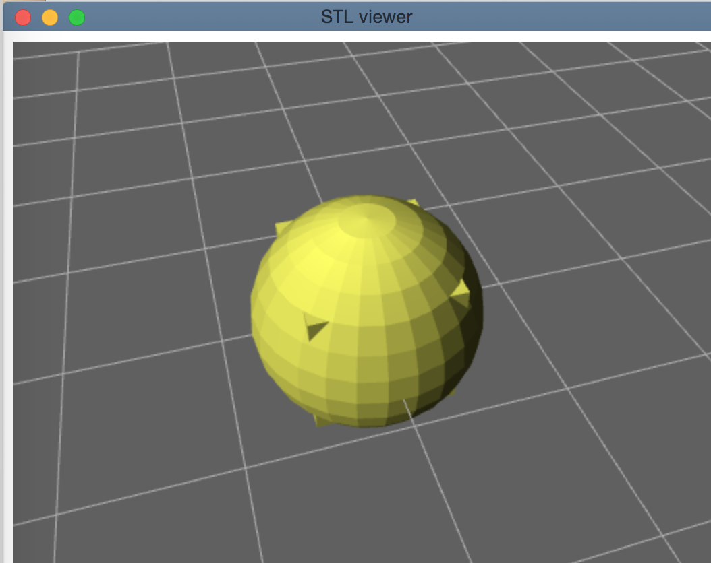

Pittari
===

# What's this?
Pittari controller for OpenSCAD

いい感じにぴったりはめてくれるツール

WIP: Currently only viewer implemented


# Install
```sh
$ git clone https://github.com/shohei/pittari.git
```

# How to use
### Dependency 
```sh
$ brew install chrome-cli 
$ brew install fswatch 
$ brew install openjscad 
```
### Initialize
```sh
$ bower install
$ bower install git://github.com/tbuser/thingiview.js.git --save-dev
$ npm install
```
### Run
```sh
go run scadview.go -f <scad_file>
```
You will see the view updated while editing scad file (auto-update)
